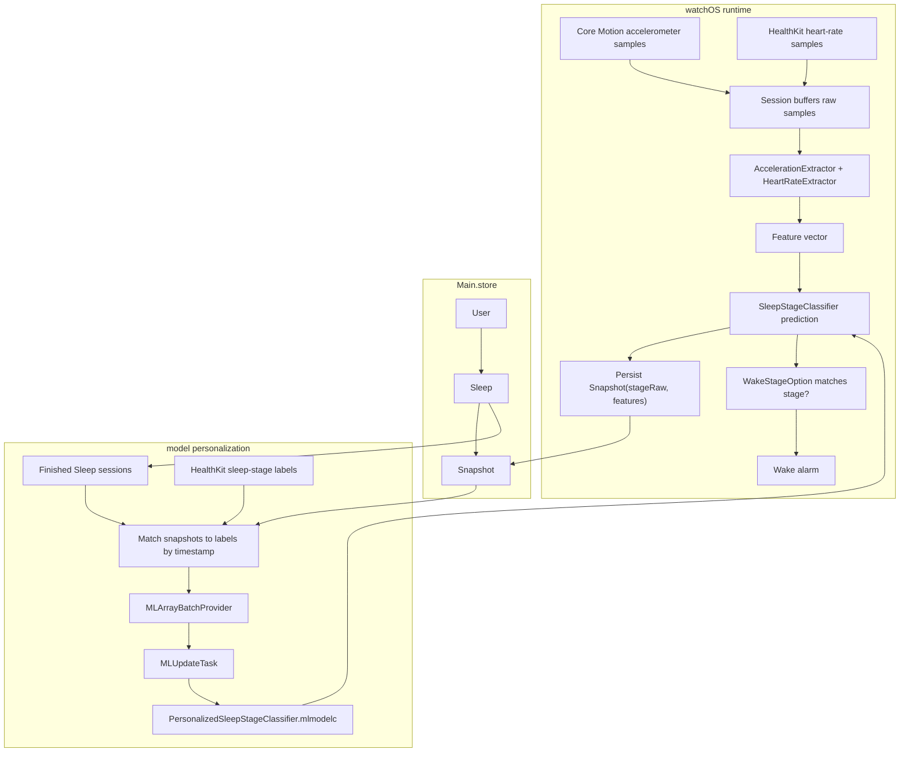

# Time :)

A watchOS 26.2+ smart alarm that runs a WKExtendedRuntimeSession, samples Core Motion and HealthKit heart rate data, extracts features, and predicts sleep stages using an on-device Core ML model. Each Sleep session is stored in SwiftData and contains snapshots of extracted features with the predicted sleep stage. After each sleep session ends, those snapshots are matched against HealthKit sleep-stage labels and used to update the model.

[View on the App Store](https://apps.apple.com/us/app/awaken-smart-alarm/id6752689654)

## Runtime

- **Session:** `WKExtendedRuntimeSession`
- **Session start:** 30 minutes before the scheduled wake time
- **Inputs:** Core Motion accelerometer samples and HealthKit heart-rate samples
- **Motion sample rate:** 50 Hz
- **Feature window:** 610 seconds
- **Prediction cadence:** 30 seconds
- **Wake lead time:** 61 seconds before the scheduled wake time
- **Model:** `watchOS/Model/SleepStageClassifier.mlmodel`
- **Persistence:** `Main.store`, `User -> Sleep -> Snapshot`
- **Personalization:** finished `Sleep` sessions matched to HealthKit sleep-stage labels

## Sleep Classification Flow



## ML Foundation

App uses the sleep-stage model from [`sleep_stage_classifier`](https://github.com/a-ponomarov/sleep_stage_classifier). That project prepares sleep-stage training data, extracts motion and heart-rate features in Swift, trains an updatable Core ML k-NN classifier, and evaluates it with leave-one-subject-out validation.

The trained model is bundled with the watchOS target:

- **Bundled model:** `watchOS/Model/SleepStageClassifier.mlmodel`
- **Model type:** updatable Core ML k-NN classifier
- **Training inputs:** wrist motion, heart rate, and labeled sleep stages

## Project Structure

```text
Time/
  README.md
  iOS/
    Model/            iOS-only identifiers and Live Activity metadata
    Module/
      Alarm/          Alarm setup, bedtime settings, recommendations, and time picker UI
      Main/           Root tab shell for Alarm, Notes, and Time
      Notes/          Notes list, note detail, text editor, and audio note cards
      Onboarding/     First-run onboarding flow and reusable onboarding cards
      Settings/       Settings sheet with support, source, and privacy links
      Subscription/   StoreKit subscription and paywall UI
      Time/           Focus timer, queue editing, duration controls, history, and task labels
    Resource/         iOS assets, entitlements, Info.plist, and StoreKit configuration
    Service/
      Alarm/          Alarm scheduling and refresh service
      Coordinator/    Root state, sheet/full-screen destinations, and navigation paths
      Countdown/      Countdown state, runtime, persistence, recovery, history, alarm, and actions
      Network/        Shared network client exposed to the iOS app container
      Store/          Subscription and entitlement state
    Widget/
      Activity/       Countdown Live Activity views, buttons, progress, text, and intents
      Complication/   Alarm time widget and timeline provider
      Resource/       Widget assets, entitlements, and Info.plist
      WidgetsBundle.swift
    AppContainer.swift
    TimeApp.swift
  watchOS/
    Model/            Watch-only models and bundled sleep-stage classifier
    Module/
      Alarm/          Watch alarm controls, wake-stage picker, and heart-rate option
      Dreams/         Dream list, rows, row models, and detail view
      Lifetime/       Birthday setup, current seconds, and milestone carousel
      Log/            Sleep/session log list and rows
      Main/           Watch tab shell for Alarm, Dreams, Lifetime, and Log
    Resource/         watchOS assets, entitlements, and Info.plist
    Service/
      Classifier/     Core ML model loading, feature extraction, prediction, and updates
      Coordinator/    Routes, sheets, alerts, full-screen destinations, and navigation state
      RawDataSource/  HealthKit and Core Motion data sources
      Session.swift   Extended-runtime sleep session orchestration
    View/
      DatePicker/     Reusable watch date picker components
      TimePicker/     Reusable watch time picker components and formatting
      ClockView.swift
      WatchList.swift
    Widget/           Watch alarm widget, defaults, timeline provider, resources, and bundle
    AppContainer.swift
    TimeWatchApp.swift
  Shared/
    Extension/        Date, formatter, font, and card-style helpers
    Model/            SwiftData models for alarms, dreams, logs, notes, sleep, snapshots, time, and users
    Resource/         Colors, constants, fonts, app icon, layout, strings, localization, and code style
    Service/
      Audio/          Recording, playback, audio file management, and waveform calculation
      Persistence/    SwiftData schema, containers, repositories, key-value store, and logger
      Task/           Shared app task helpers
    View/
      Alarm/          Shared alarm complication view
      Audio/          Shared audio controls and waveform view
      Components/     Shared circular progress and duration slider views
  Frameworks/         Xcode framework group
  Products/           Xcode build products group
```
