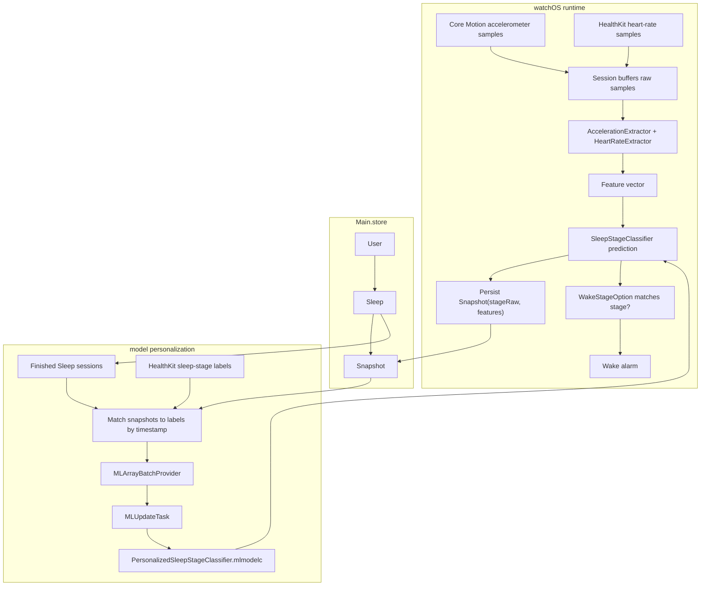

# Awaken: Smart Alarm

A watchOS 26.2+ smart alarm that runs a WKExtendedRuntimeSession, samples Core Motion and HealthKit heart rate data, extracts features, and predicts sleep stages using an on-device Core ML model. Each Sleep session is stored in SwiftData and contains snapshots of extracted features with the predicted sleep stage. After each sleep session ends, those snapshots are matched against HealthKit sleep-stage labels and used to update the model.

[View on the App Store](https://apps.apple.com/us/app/awaken-smart-alarm/id6752689654)

## Runtime

- **Session:** `WKExtendedRuntimeSession`
- **Session start:** 30 minutes before the scheduled wake time
- **Inputs:** Core Motion accelerometer samples and HealthKit heart-rate samples
- **Motion sample rate:** 50 Hz
- **Feature window:** 610 seconds
- **Prediction cadence:** 30 seconds
- **Wake lead time:** 61 seconds before the scheduled wake time
- **Model:** `watchOS/Model/SleepStageClassifier.mlmodel`
- **Persistence:** `Main.store`, `User -> Sleep -> Snapshot`
- **Personalization:** finished `Sleep` sessions matched to HealthKit sleep-stage labels

## Sleep Classification Flow



## ML Foundation

Awaken uses the sleep-stage model from [`sleep_stage_classifier`](https://github.com/a-ponomarov/sleep_stage_classifier). That project prepares sleep-stage training data, extracts motion and heart-rate features in Swift, trains an updatable Core ML k-NN classifier, and evaluates it with leave-one-subject-out validation.

The trained model is bundled with the watchOS target:

- **Bundled model:** `watchOS/Model/SleepStageClassifier.mlmodel`
- **Model type:** updatable Core ML k-NN classifier
- **Training inputs:** wrist motion, heart rate, and labeled sleep stages

## Project Structure

```text
Awaken/
  iOS/
    Model/           Alarm identifiers and Live Activity metadata
    Module/
      Alarm/         Alarm setup, recommendations, and time controls
      Main/          Root tab shell
      Notes/         Text notes, audio note cards, note list, and note detail UI
      Settings/      Support, source code, and privacy links
      Subscription/  StoreKit paywall
      Time/          Focus timer, duration controls, history, and task labels
    Resource/        Assets, entitlements, Info.plist, and StoreKit configuration
    Service/
      Alarm/         Wake alarm scheduling and observation
      Coordinator/   Root, tab, sheet, and full-screen navigation
      Countdown/     Timer state, persistence, recovery, runtime, and alarm actions
      Network/       Networking service
      Store/         Subscription and entitlement state
    Widget/          Live Activity, alarm complication, intents, resources, and widget bundle
    AppContainer.swift
    AwakenApp.swift
  watchOS/
    Model/           Watch-only models
    Module/          Alarm, dreams, log, lifetime, and main screens
    Resource/        Assets, entitlements, Info.plist, and ML model
    Service/
      Classifier/    Model loading, feature extraction, prediction, and personalization
      Coordinator/   Routes, sheets, alerts, and full-screen navigation
      RawDataSource/ HealthKit and Core Motion sources
      Session.swift  Sleep-session runtime
    View/            Reusable watch controls and pickers
    Widget/          Alarm complication, timeline provider, defaults, and widget bundle
    AppContainer.swift
    AwakenApp.swift
  Shared/
    Extension/       Swift extensions used across targets
    Model/           SwiftData models and widget timeline entries
    Resource/        Colors, fonts, strings, layout constants, and style guide
    Service/
      Audio/         Recording, playback, file storage, and waveform extraction
      Persistence/   SwiftData containers, schema, repositories, and logger
      Task/          Shared task helpers
    View/            Audio controls, shared progress views, and alarm complication UI
```
